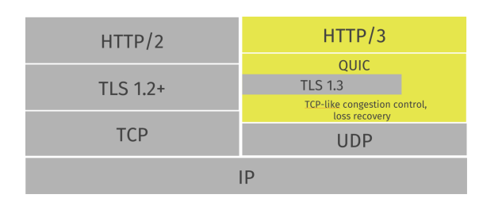

# UDP

## 개요

UDP (User Datagram Protocol) 은 전송계층(OSI 4계층)의 연결 없음(connectionless), 비신뢰성(unreliable), 순서 보장 없음 프로토콜이다. "나 연결할게요! 통신 잘돼요?" 하고 연결을 시작하는 TCP와 달리, 얘는 “데이터에 담아 던지고 끝. 잘 갔는지는 알 바 아님”의 스타일이다. 확인 문자? 재전송? 흐름/혼잡 제어? 그런 것은 없다. 대신 지연이 작고 오버헤드가 적다는 강력한 장점이 있다.

## 간략히

- 언제 쓰냐:

  - 실시간이 생명인 것들 — VoIP, 온라인 게임, 스트리밍(RTP), DNS 질의, DHCP, NTP, Syslog,
  - QUIC(HTTP/3의 바닥) 같은 프로토콜. UDP를 기반으로 혼잡, 흐름 제어 별도 구현함

- 뭘 안 해주냐:

  - 연결 수립, 재전송, 순서 보장, 흐름/혼잡 제어. 전부 애플리케이션(혹은 상위 프로토콜)이 책임져야 한다.

- 왜 좋냐:
  - 헤더 8바이트 -> 용량 적음
  - 빠르고 단순하다. 내가 통신 과정 제어 가능함. 대신 다듬는 건 스스로 잘해야 할 것.

## 헤더 구조

```
0               15 16              31 (bit)
+----------------+-----------------+
| Source Port    | Destination Port |
+----------------+-----------------+
| Length         | Checksum         |
+----------------+-----------------+
(총 8바이트)
```

- **Source/Destination, Port**: 16비트. IANA 기준 Well-known 0–1023, Registered 1024–49151, Dynamic/Ephemeral 49152–65535.

- **Length**: UDP 헤더 + 데이터 전체 길이.

- **Checksum**:
  - 16비트 1의 보수 합.
  - IPv4에선 선택적(0 허용), IPv6에선 필수. 계산 시 IP 의사헤더(출발지/목적지 IP, 프로토콜 번호, UDP 길이)를 포함해 네트워크 중간 변조도 어느 정도 잡아낸다.
  - checksum이 있다고 해서 **무결성이 보장되는 건 아니다.**

## 대표 활용 사례

- **DNS(Domain Name System)**:
  - 왕복 빨라야 하니 UDP(대부분). 크면 TCP로 폴백
- **DHCP(Dynamic Host Configuration Protocol)**: 브로드캐스트로 IP 임대.
- **RTP/RTCP**: 실시간 오디오·비디오 스트리밍.
- **NTP**: 시간 동기화.
- **Syslog/StatsD**: 로깅/메트릭 파이프—유실 감내.
- **QUIC**:
  
  - UDP 위에 TLS 1.3 + 혼잡제어 + 스트림 멀티플렉싱 얹은 프로토콜.
  - HTTP/3가 이걸 활용한다.
